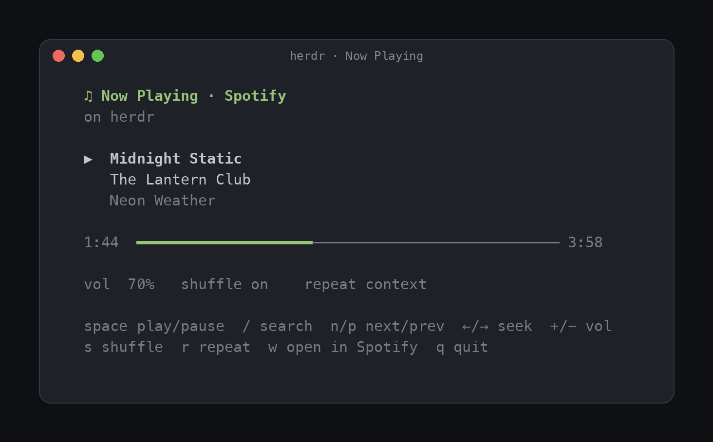
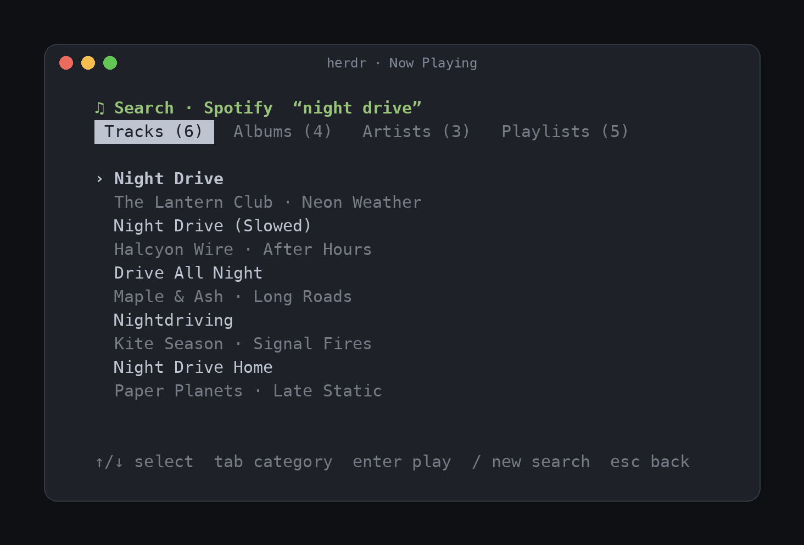

# Now Playing for Spotify — a herdr plugin

See and control what's playing on Spotify without leaving [herdr](https://herdr.dev):

- **Player pane**: track, artist, album, progress, volume, shuffle/repeat, with keyboard controls
- **Search**: find tracks, albums, artists and playlists and play them, from the pane or the CLI
- **Agents panel**: the player pane shows up as an agent, titled with the current track
- **CLI**: `nowplaying next`, `nowplaying now`, … for scripts and key bindings

<p>
  
  
</p>

<sub>Track names in the screenshots are fictional demo data.</sub>

> **Not affiliated with Spotify.** This is an unofficial, community plugin. "Spotify" is a trademark
> of Spotify AB, used here only to describe compatibility.

## Requirements

- herdr 0.7.5 or newer, macOS
- Python 3.9+ (the system `python3` works; standard library only)
- One playback backend:

| Backend | What plays the music | Setup | Spotify account |
|---|---|---|---|
| **Spotify app** (default fallback) | the Spotify desktop app | none | Free or Premium |
| **spotify_player** | the headless [`spotify_player`](https://github.com/aome510/spotify-player) daemon, no Spotify app needed | build + your own Spotify client ID | **Premium** |

The plugin picks `spotify_player` if it is installed, otherwise the Spotify app. Override with
`backend` in the config file.

## Install

```sh
herdr plugin install reidsolon/herdr-nowplaying
# or pin a release
herdr plugin install reidsolon/herdr-nowplaying --ref v0.2.2
```

Optional: put the `nowplaying` command on your PATH.

```sh
ln -s "$(herdr plugin list --json | python3 -c 'import json,sys; print([p for p in json.load(sys.stdin)["result"]["plugins"] if p["plugin_id"]=="reidsolon.nowplaying"][0]["plugin_root"])')/bin/nowplaying" ~/.local/bin/nowplaying
```

### Option A: Spotify desktop app

Nothing else to do. Keep the Spotify app running (closing its window is fine; quitting it stops
playback). macOS will ask once to let herdr control Spotify.

### Option B: headless `spotify_player` (Premium)

1. **Build `spotify_player` with daemon support.** On macOS the daemon needs media control turned
   off at build time, so the Homebrew bottle won't work:

   ```sh
   cargo install spotify_player --locked --no-default-features --features daemon,rodio-backend
   ```

2. **Create your own Spotify client ID.** Spotify's Developer Policy expects each app to use its
   own credentials, and the shared default ID that `spotify_player` falls back to is heavily
   rate-limited (controls will lag or fail with `429`).
   - Open the [Spotify Developer Dashboard](https://developer.spotify.com/dashboard) and **Create app**
   - Redirect URI: `http://127.0.0.1:8989/login`
   - APIs: tick **Web API**
   - Copy the **Client ID**

3. **Configure `spotify_player`** in `~/.config/spotify-player/app.toml`:

   ```toml
   client_id = "<your client id>"
   client_port = 18080          # default 8080 often clashes with dev servers
   enable_notify = false
   enable_media_control = false # required for daemon mode on macOS

   [device]
   name = "herdr"               # the Spotify Connect device name you'll see in Spotify
   device_type = "computer"
   bitrate = 160
   ```

4. **Log in once.** Open the player (`nowplaying`) and press `a`, or run:

   ```sh
   nowplaying login    # opens your browser, then starts the daemon
   nowplaying here     # move playback to the "herdr" device
   ```

   The player notices when you're logged out (first run, a new client ID, an expired token) and
   asks you to log in instead of failing silently. `spotify_player` keeps two logins (streaming and
   Web API) and opens one browser tab per step; steps you've approved before finish on their own.

## Usage

### CLI

```
nowplaying            open the player (split pane; switches to it if already open)
nowplaying popup      open the player as a popup
nowplaying play       play/pause            nowplaying next | prev   skip
nowplaying now        print what's playing  nowplaying web           open track in Spotify
nowplaying here       move playback to the spotify_player device
nowplaying search <query>          list tracks, albums, artists, playlists
nowplaying search --play <query>   play the top track
nowplaying login      log in to Spotify in your browser, then start the daemon
nowplaying daemon     start the spotify_player daemon
```

Without the symlink, every command is also a plugin action:
`herdr plugin action invoke --plugin reidsolon.nowplaying <open|open-popup|play-pause|next|previous|play-here>`.

### Player keys

| Key | Action | Key | Action |
|---|---|---|---|
| `space` | play / pause | `s` | shuffle |
| `n` / `p` | next / previous | `r` | repeat |
| `←` / `→` | seek ∓10s | `w` | open track in Spotify |
| `+` / `-` | volume | `t` | play on the spotify_player device |
| `o` | start the player/app | `q` | close the pane (music keeps playing) |
| `/` | search | `a` | log in (shown when you're logged out) |

In search results: `↑`/`↓` (or `j`/`k`) select, `Tab`/`←`/`→` switch category, `Enter` plays the
track, album, artist or playlist, `/` searches again, `Esc` goes back. Search needs the
`spotify_player` backend; with the Spotify app backend, `/` opens the app's own search.

The pane never waits on Spotify: play/pause and volume update instantly, a picked result shows as
"starting…" right away, and the plugin confirms Spotify actually switched (retrying once if it
didn't) before showing it as playing.

### Key bindings

```toml
[[keys.command]]
key = "prefix+m"
type = "plugin_action"
command = "reidsolon.nowplaying.open"          # or .open-popup
description = "open now playing"

[[keys.command]]
key = "prefix+alt+n"
type = "plugin_action"
command = "reidsolon.nowplaying.next"
description = "next track"
```

## Configuration

Copy [`config.example.toml`](config.example.toml) to the plugin config directory
(`herdr plugin config-dir reidsolon.nowplaying`) as `config.toml`.

| Key | Default | |
|---|---|---|
| `backend` | `"auto"` | `auto`, `spotify_player` or `applescript` |
| `spotify_player_bin` | `""` | path if not on PATH or in `~/.cargo/bin` |
| `autostart_player` | `false` | start the spotify_player daemon when the herdr server starts |

## Privacy

This plugin collects nothing and makes no network requests of its own.

- It reads playback state from the Spotify app (AppleScript) or the local `spotify_player` CLI.
- It reads `spotify_player`'s local log only to detect rate-limit errors.
- Spotify login and tokens are handled entirely by `spotify_player` and stored in
  `~/.cache/spotify-player/`. To disconnect: delete that folder and remove the app under
  [Spotify account → Manage apps](https://www.spotify.com/account/apps/).

## Compliance notes

- **No credentials are shipped.** Each user registers their own client ID, as the
  [Spotify Developer Policy](https://developer.spotify.com/policy) requires one set of credentials per app.
- **Premium** is required by Spotify for playback through third-party players (Option B).
- **`spotify_player` is not part of this plugin.** It is a separate MIT-licensed project built on
  [librespot](https://github.com/librespot-org/librespot), an unofficial Spotify client
  library. You install and run it yourself; review its terms and Spotify's
  [Developer Terms](https://developer.spotify.com/terms) before using it.
- **Attribution**: Spotify metadata is shown alongside the Spotify name, and `w` / `nowplaying web`
  links back to the track on Spotify, per the
  [Design & Branding Guidelines](https://developer.spotify.com/documentation/design). Logos can't be
  drawn in a terminal, so the name is used in text.
- The plugin name uses "for Spotify" to describe compatibility, as Spotify's guidelines allow, and does not
  use Spotify logos.

## Troubleshooting

- **Controls lag or do nothing, the pane says "rate-limited (429)"**: you're on the shared default
  client ID. Set your own `client_id` (Option B, steps 2–3), then press `a` in the player or run `nowplaying login`.
- **Paused at 0:00 after a while**: `spotify_player` lost its connection to Spotify and reconnected
  paused. Run `nowplaying play`.
- **"Spotify lost the player device; reconnecting…"**: after sleep or a network change,
  `spotify_player`'s Spotify Connect connection can die while the daemon keeps running, and Spotify
  answers every request with `404`. The plugin restarts the daemon to register the device again and
  retries your command once.
- **"spotify_player had stopped responding; restarted it."**: the daemon was still connected to
  Spotify but had stopped accepting commands (it happens after long uptimes). The plugin restarted
  it; press play again.
- **"player not running"**: `nowplaying daemon` (Option B), or open the Spotify app (Option A).
- **"Not logged in to Spotify"**: press `a` in the player or run `nowplaying login`. If the browser
  shows `INVALID_CLIENT: Invalid redirect URI`, add exactly `http://127.0.0.1:8989/login` to your
  app's Redirect URIs in the Spotify dashboard.
- **Logs**: `~/.cache/spotify-player/*.log`, `herdr plugin log list`.

## Development

```sh
git clone https://github.com/reidsolon/herdr-nowplaying && cd herdr-nowplaying
herdr plugin link .     # herdr runs your working copy; reopen the pane to pick up changes
```

Screenshots are rendered from the real UI with fictional data:
`pip install pyte pillow fonttools && python docs/render_screenshots.py . docs`.

## License

[MIT](LICENSE)
